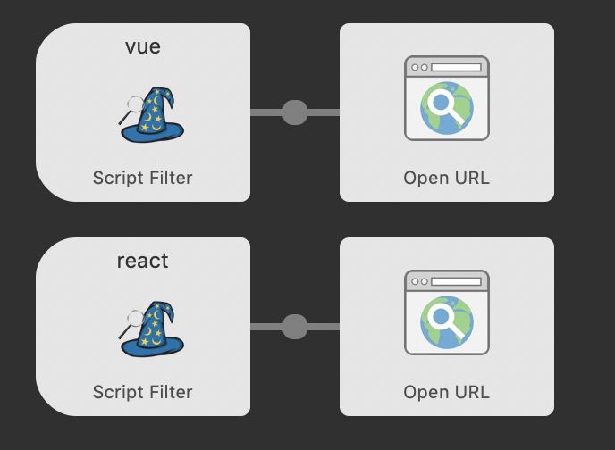

# React文档查询/Vue文档查询
#### WorkFlow查询关键字:`react`,`vue`
#### 例子:

Tips:

1.Vue与React文档检索代码部分基本相同,调用的是algolia的搜索,你可以通过修改配置项添加自己的文档搜索,具体见 https://www.algolia.com/doc/api-reference/

2.同理,如果想搜索英文文档,请直接寻找对应的Key做替换即可.

#### 设置与代码
在此处设置

