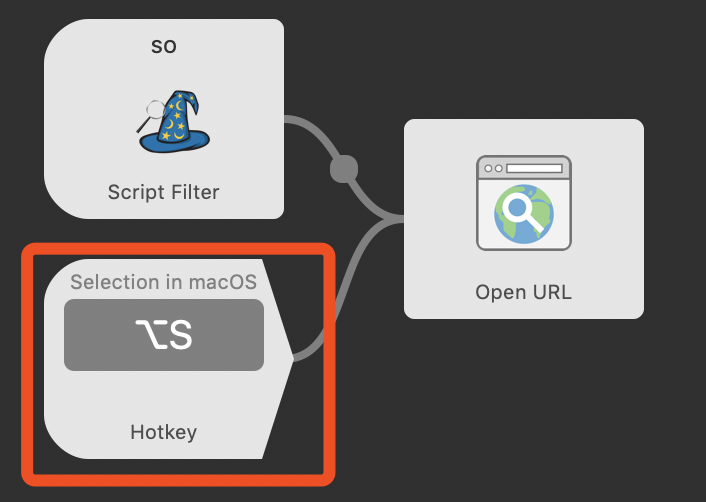
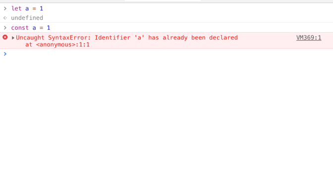

#  StackOverFlow中文查询
####  WorkFlow查询关键字:`so`
####  例子:

Tips:

1.使用的API为有道词典标准翻译,不一定准,但是可以省你不少时间.你可以在进入页面后自行修饰搜索词汇.

2.由于未对中英文输入做区分,输入英文可能出现不可预料的Bug.(如果是查报错的话应该就直接用快捷键了吧?没人会再敲一遍吧?)

####  快捷键查询
在此处设置

设置后选中内容并使用快捷键即可一键查询.

**注意!使用API查询的方式是有限制的(一定时间内300次),如果频繁查询可能会出现400错误.因为这个问题我将节流时间调的很大,如果用起来体验不佳请自行调整Script的节流时间.**
